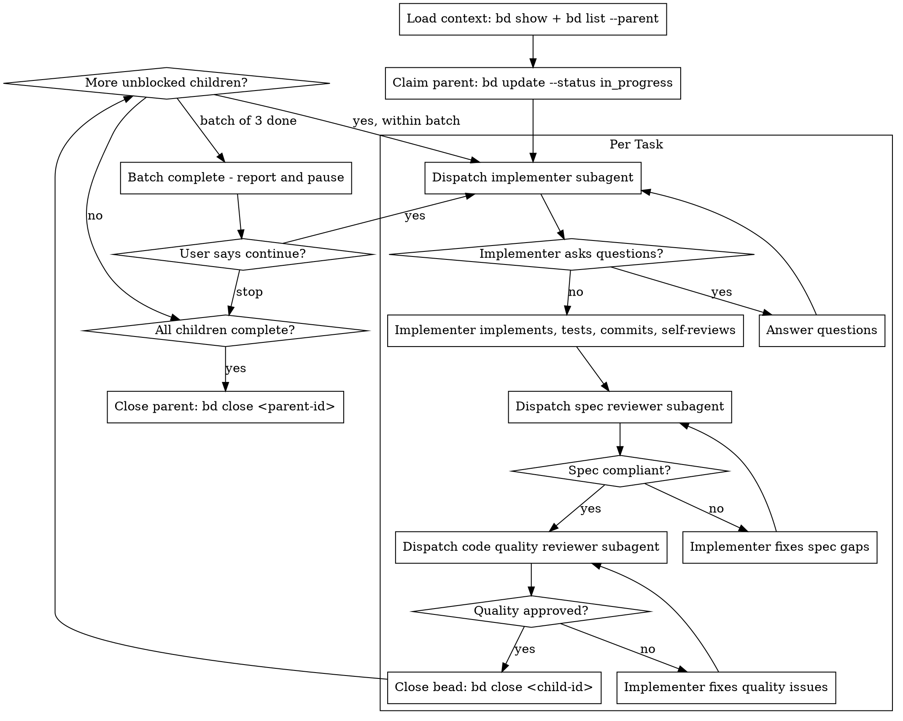

# Beads Execute

## Overview

Execute child beads using fresh subagent per task, with two-stage review after each: spec compliance first, then code quality.

**Core principle:** Fresh subagent per task + two-stage review = high quality, no context pollution

**Announce at start:** "I'm using beads-execute to implement the planned tasks."

## Prerequisites

Before using this skill:
- Parent bead should have child beads (created by `/beads-plan`)
- Parent bead should have notes describing approach
- No code should have been written yet

If prerequisites not met, suggest running `/beads-plan <bead-id>` first.

## The Process



## Step 1: Load Plan Context

```bash
bd show <parent-id>           # Read parent with notes
bd list --parent <parent-id>  # See all child beads
```

Extract ALL child bead descriptions upfront. Subagents receive full text, not IDs.

## Step 2: Claim Parent

```bash
bd update <parent-id> --status in_progress
```

## Step 3: Execute Tasks (3 per batch)

For each unblocked child bead:

### 3a. Claim bead

```bash
bd update <child-id> --status in_progress
```

### 3b. Dispatch Implementer Subagent

Use `./implementer-prompt.md` template. Provide:
- Full task description (from bead)
- Context from parent notes
- Working directory

If subagent asks questions → answer them, resume subagent.

Wait for: implementation complete, tests passing, committed.

### 3c. Dispatch Spec Reviewer Subagent

Use `./spec-reviewer-prompt.md` template. Provide:
- Full task requirements
- Implementer's report

If issues found → implementer fixes → re-review until ✅

### 3d. Dispatch Code Quality Reviewer Subagent

**Only after spec compliance passes.**

```
Task tool:
  subagent_type: "superpowers:code-reviewer"
  prompt: [use requesting-code-review template with BASE_SHA, HEAD_SHA, task description]
```

If issues found → implementer fixes → re-review until ✅

### 3e. Close Bead

```bash
bd close <child-id>
```

## Step 4: Report and Pause (Every 3 Tasks)

```
Batch complete:
- [x] <child-id>: <description>
- [x] <child-id>: <description>
- [x] <child-id>: <description>

Remaining:
- [ ] <child-id>: <description>

Ready for review. Continue with next batch?
```

**WAIT for user feedback before continuing.**

## Step 5: Close Parent

When all children complete:

1. **Check README:** Apply `readme-sync` skill - does this feature affect user workflows?
2. **Close parent:**
   ```bash
   bd close <parent-id>
   ```

Report: "Feature complete. All tasks finished."

## Prompt Templates

- `./implementer-prompt.md` - Dispatch implementer subagent
- `./spec-reviewer-prompt.md` - Dispatch spec compliance reviewer

## Handling Blockers

If blocked mid-task:

1. **Don't force it** - stop and report
2. **Add context:**
   ```bash
   bd comment <child-id> "Blocked: <description>"
   bd update <child-id> --status blocked
   ```
3. **Ask for guidance**

## Work Discovery

If subagent discovers new work:

```bash
bd create "Fix unexpected issue" --discovered-from <current-id> --type bug
```

Don't get sidetracked - capture and continue.

## Session Boundary

If session needs to end mid-execution:

1. Close completed children
2. Leave current child as in_progress with comment about state
3. Leave parent as in_progress
4. Sync beads: `bd sync`
5. Commit work: `git add . && git commit -m "wip: partial implementation"`

Next session picks up with: `/beads-execute <parent-id>`

## Red Flags - STOP

- Implementing without loading plan first
- Skipping beads or doing them out of dependency order
- Not closing completed children
- Continuing past batch without user check-in
- Force-completing blocked work
- **Skipping spec review** - must verify before quality review
- **Skipping code quality review** - must run after spec passes
- **Starting quality review before spec ✅** - wrong order
- **Main agent implementing** - always use implementer subagent

## Integration with Other Skills

**During execution:**
- **superpowers:code-reviewer** - Quality review after spec compliance
- **superpowers:test-driven-development** - Subagents follow TDD

**After all work complete:**
- `bd sync` to sync beads
- `/wrapup` for full session close
